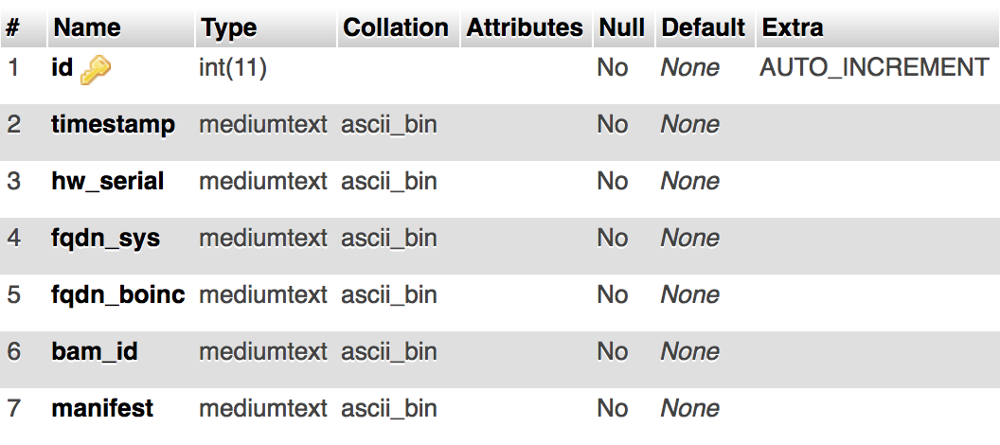

# boincReport Installation

1. Put the boincReport directory onto a local webserver accessible by all BOINC Clients in the setup. PHP ≥ 4.2 is required. HTTPS would be ideal to protect sensitive data.
2. Setup a MySQL database named boincReport and a table named boinc with the following structure:
    
    
3. The following configuration changes need to be made to the files:
    - MySQL server location, username, and password in `index.php`, `btxml.php`, `boincReport.php`, `bamify.php`
    - Proxy information and BAM Username in `bamify.php`
    - Munki manifest sorting in `bamify.php`. By default, conputers with munki manifest names containing `desktop-staff` are put into BAM group `Staff_Desktops`, `desktop-student` are put into `Student_Desktops`, and `laptop-school` are put into `School_Laptops`. Any other computers are put into `Other`
4. To automate the grouping of hosts on BAM, add the following command to the webserver's crontab using `crontab -e`
    
    ```
    0 */12 * * * curl -x '' "http://BOINCREPORT_SERVER/bamify.php?bampass=BAMPASS"
    ```
